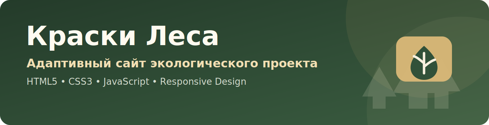
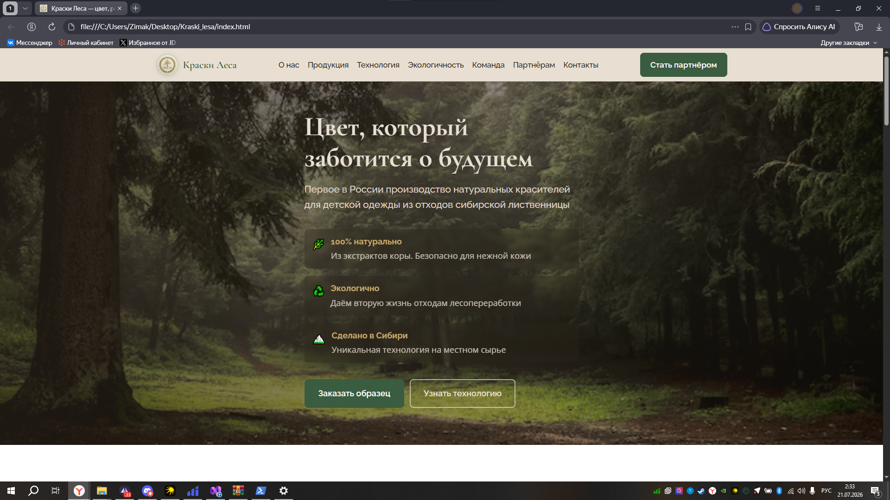
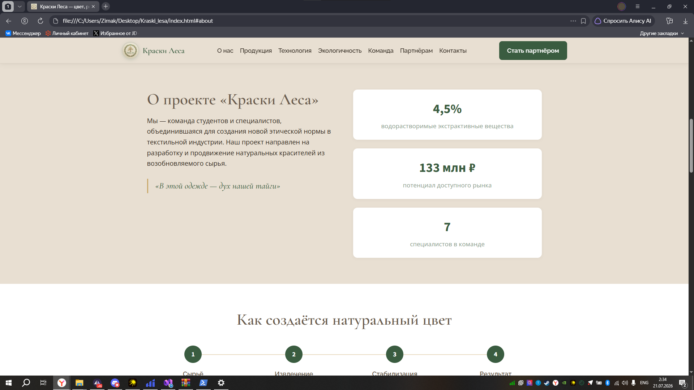
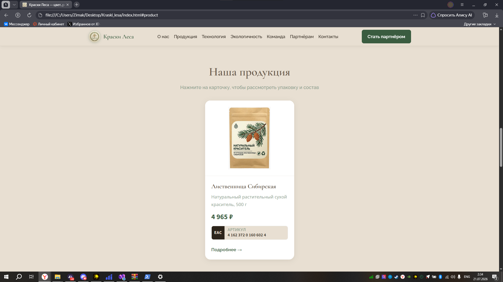
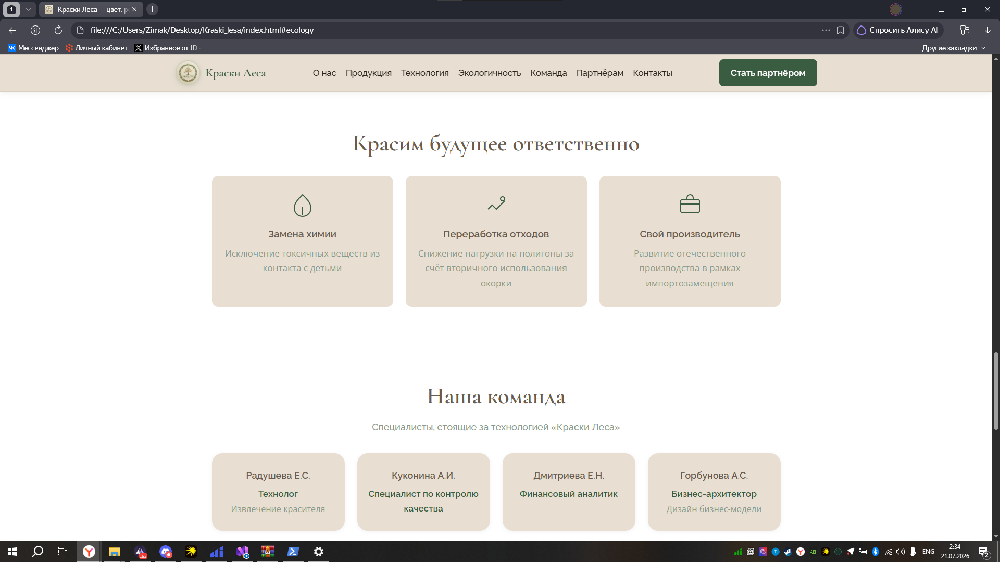
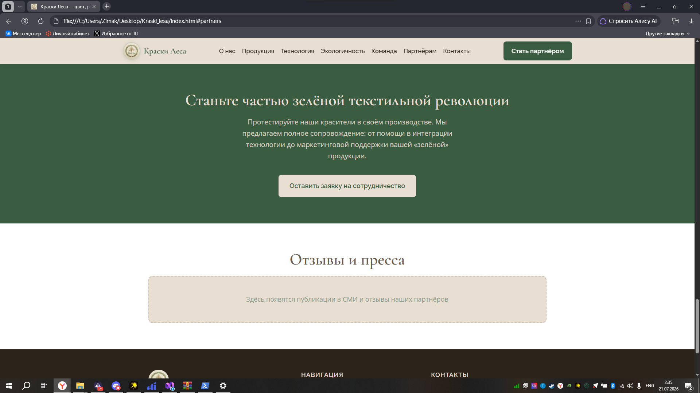
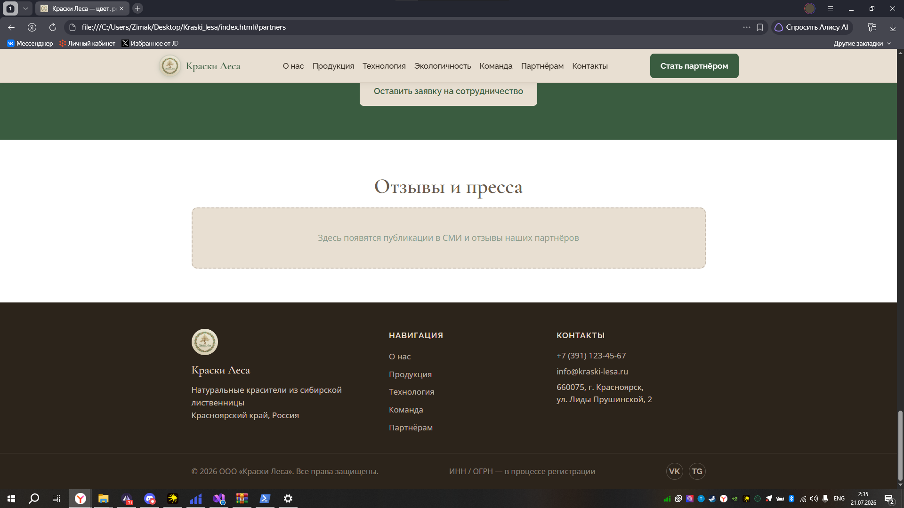

<div align="center">



# Краски Леса

**Адаптивный сайт проекта натуральных красителей из сибирской лиственницы**

`HTML5` · `CSS3` · `JavaScript` · `Responsive Design`

</div>

---

## О проекте

**Краски Леса** — адаптивный одностраничный сайт экологического проекта, посвящённого производству натуральных красителей для детской одежды из отходов сибирской лиственницы.

Сайт знакомит посетителей с идеей проекта, технологией производства, продукцией, результатами окрашивания, экологическими преимуществами и командой. Интерфейс адаптирован для настольных и мобильных устройств.

## Основные возможности

- адаптивная верстка для разных размеров экрана;
- навигация по разделам одностраничного сайта;
- мобильное меню;
- карточка продукта с подробным модальным окном;
- переключение изображений упаковки по вкладкам;
- фотогалерея результатов окрашивания;
- полноэкранный просмотр изображений с навигацией;
- копирование артикула товара;
- визуальные блоки о технологии, экологичности и команде;
- семантическая HTML-разметка и базовые элементы доступности.

---

## Интерфейс сайта

### Главный экран и презентация проекта

<p align="center">
  
  
</p>

### Технология и продукция

<p align="center">
  
  
</p>

### Экологичность, команда и партнёрство

<p align="center">
  
  
</p>

---

## Технологии

| Область | Используемые технологии |
|---|---|
| Разметка | HTML5 |
| Стилизация | CSS3 |
| Интерактивность | JavaScript |
| Адаптивность | Media Queries, Flexbox, CSS Grid |
| Шрифты | Google Fonts |
| Графика | SVG, AVIF, PNG, JPG |
| Контроль версий | Git, GitHub |

## Структура проекта

```text
Kraski-Lesa/
├── index.html                   основная страница сайта
├── css/
│   └── styles.css               стили и адаптивная верстка
├── js/
│   └── main.js                  меню, модальные окна и галерея
├── res/
│   ├── favicon.svg              иконка сайта
│   ├── logo.jpg                 логотип проекта
│   ├── les.avif                 фоновое изображение главного экрана
│   ├── result/                  результаты окрашивания
│   └── tovar/                   изображения товара и упаковки
├── docs/
│   ├── assets/                  графические материалы README
│   └── screenshots/             скриншоты интерфейса
├── .gitignore
└── README.md
```

## Локальный запуск

Для запуска не требуется установка дополнительных зависимостей или сборка проекта.

1. Клонировать репозиторий:

```bash
git clone https://github.com/zimin-nikolay/Kraski-Lesa.git
cd Kraski-Lesa
```

2. Открыть файл `index.html` в браузере.

Для корректной проверки сайта также можно запустить локальный сервер, например через расширение **Live Server** в Visual Studio Code.

<div align="center">

Разработчик: **Николай Зимин**

</div>
